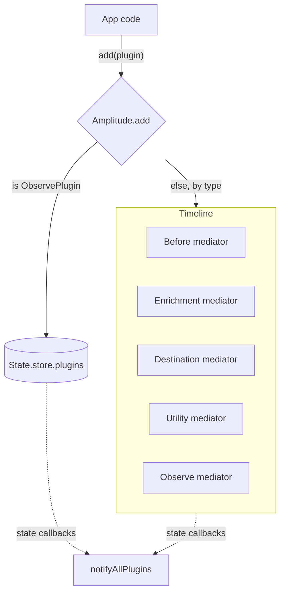
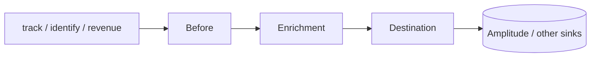
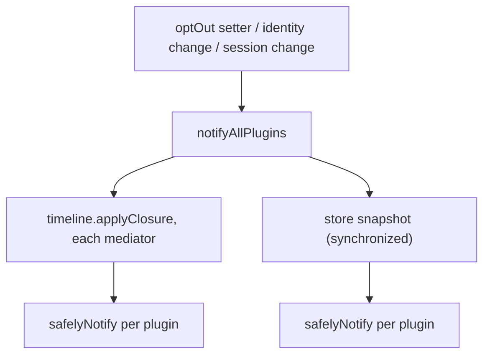
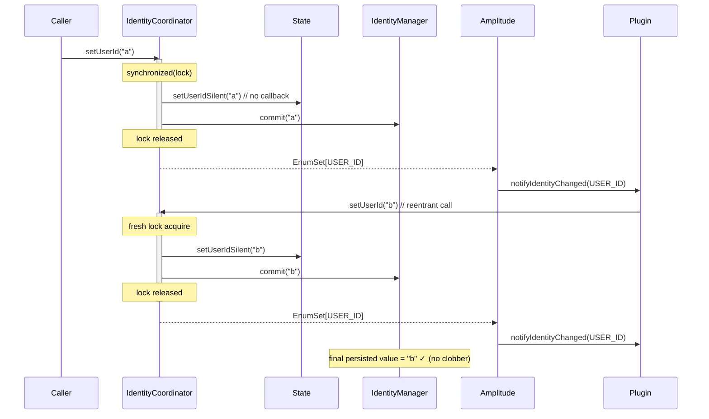

# Plugins & Identity — `com.amplitude.core`

A short guide to how the SDK is extended (plugins) and how identity (userId /
deviceId / sessionId) flows to those plugins. If you're touching `Plugin`,
`Timeline`, `State`, or `IdentityCoordinator`, read this first.

---

## 1. Plugins

A **plugin** observes or transforms the SDK's behaviour. Every plugin declares a
`Plugin.Type` that decides *where* it runs.

| Type | Runs during event processing? | Lives in |
|------|-------------------------------|----------|
| `Before` | yes — first, can mutate/enrich every event | Timeline mediator |
| `Enrichment` | yes — after `Before` | Timeline mediator |
| `Destination` | yes — terminal, sends events out | Timeline mediator |
| `Utility` | no — side-channel helpers | Timeline mediator |
| `Observe` | no — reacts to state changes only | see note below |

There are two ways a plugin reaches the "Observe" world:

- An **`ObservePlugin`** (the abstract class) is routed by `Amplitude.add()` to the
  **`State` store**, *not* the timeline.
- A plain **`Plugin` that just declares `type = Observe`** lands in the timeline's
  `Observe` mediator. (Before SDKA-6 there was no such mediator and these plugins
  were silently dropped — that gap is now closed.)

Both buckets receive state-change callbacks (§3).

### Lifecycle

- `add(plugin)` — if `plugin.name != null`, any existing plugin with the same name
  is removed (and `teardown()` called) first. **Dedup is best-effort**: `add()` is
  expected to be called from a single thread.
- `setup(amplitude)` — wiring; `teardown()` — cleanup.
- `findPlugin<T>()` — look a plugin up by type across **both** the timeline mediators
  and the store (store iteration is snapshotted under a lock).

### Event flow (the processing types)

`Observe` and `Utility` plugins are **not** in this path — they never see the event
stream, only the callbacks below.

---

## 2. State-change callbacks

`Plugin` exposes no-op default callbacks so existing plugins are unaffected:

- `onUserIdChanged(userId)` / `onDeviceIdChanged(deviceId)`
- `onSessionIdChanged(sessionId)` *(Android only — it owns sessions)*
- `onOptOutChanged(optOut)`
- `onReset()` *(paired with a bundled identity change)*

They are delivered by `Amplitude.notifyAllPlugins`, which fans the callback out to
**every** plugin — timeline mediators **and** a snapshot of the store. Each
invocation is isolated by `safelyNotify`: a throwing plugin is logged, not
propagated, so one bad plugin can't break the fan-out or the event loop.

> **Delivery is latest-value, not per-transition.** Identity mutation is expected
> from a single thread; if a value changes again before its callback runs,
> notifications may coalesce to the most recent value. The value a plugin sees is
> always consistent with the instance's current identity.

---

## 3. Identity changes & reentrancy

Identity (userId / deviceId) is owned by **`IdentityCoordinator`**, which keeps two
things in sync: the in-memory `State` and the persisted `IdentityManager`.

`IdentityCoordinator` mutates are **lock-guarded, commit-first, notify-after**:
`setUserId`, `setDeviceId`, and `resetIdentity` each write + commit under the lock,
then return an `EnumSet<State.IdentityChange>` describing what changed.
`Amplitude.notifyIdentityChanged` receives that set and fans out the appropriate
callbacks *after* the lock is released.

The tricky part: a plugin's `onUserIdChanged` callback may itself call
`setUserId(...)` — on the **same thread**. Because JVM `synchronized` is
**reentrant**, a naive "notify while holding the lock" design lets that inner call
fully commit, then the *outer* call commits its older value last and **silently
clobbers** the inner write.

**The fix — commit under the lock, notify after releasing it:**

Key points:

- **Writes happen under the lock** (`setUserIdSilent` / `setDeviceIdSilent` + commit)
  so state + persistence stay atomic.
- **`IdentityCoordinator` returns an `EnumSet<State.IdentityChange>`** describing
  which fields changed. `Amplitude.notifyIdentityChanged` inspects the set and fires
  `onUserIdChanged` / `onDeviceIdChanged` as appropriate, after the lock is released.
- **Notification happens after the lock is released**, so a re-entering callback
  can't have its write overwritten by a trailing outer commit.
- `resetIdentity()` does the same with **one bundled** notification (userId +
  deviceId), and `bootstrap()` (startup reconciliation) follows the identical
  pattern.

`notifyAllPlugins` and `resetIdentity` are gated with `@RestrictedAmplitudeFeature`
(`@RequiresOptIn`) — they're for platform-SDK use, not the customer surface.
