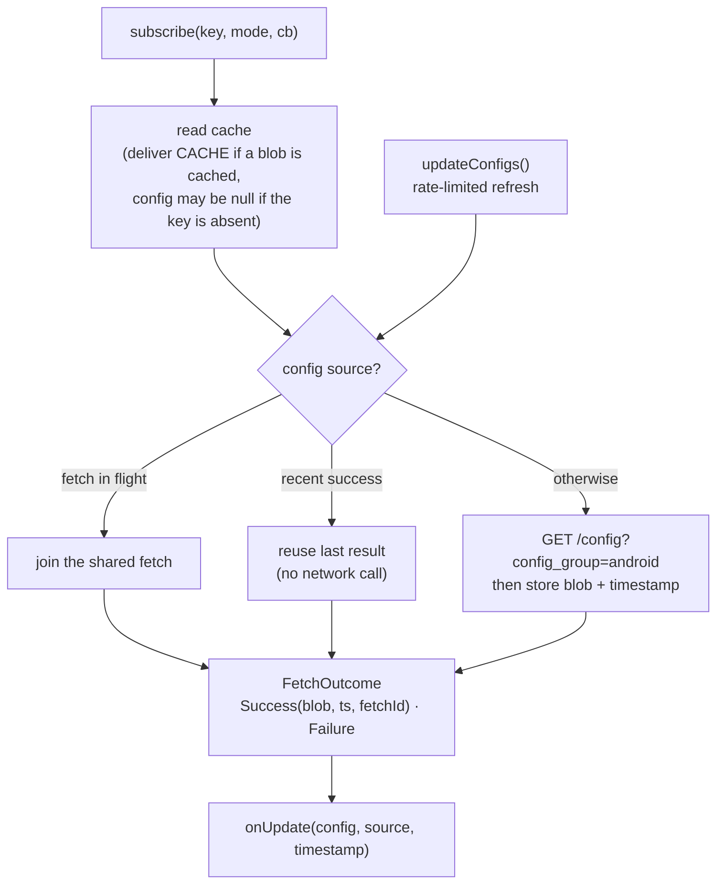
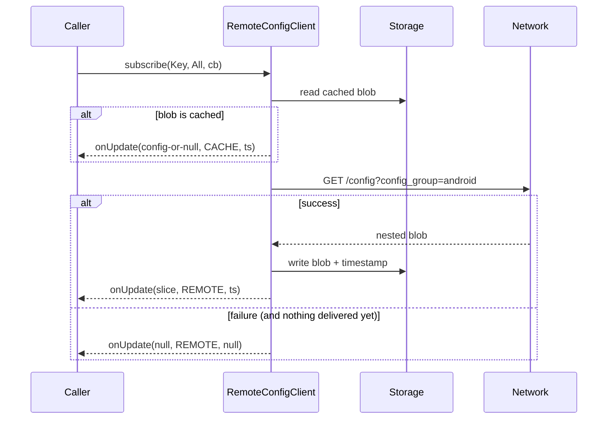

# Remote Config

Fetches a nested configuration blob from Amplitude's remote-config service and
delivers slices of it to subscribers, keyed by a dot-path. The model mirrors the
iOS (`AmplitudeCore-Swift`) and Web clients so behavior is consistent across SDKs.

- **Entry point:** `Amplitude.remoteConfigClient` → `RemoteConfigClientImpl`
- **Endpoint:** `GET https://sr-client-cfg.amplitude.com/config?api_key=…&config_group=android`
  (EU: `sr-client-cfg.eu.amplitude.com`)
- **Storage:** the full nested blob + a fetch timestamp are cached; slices are
  resolved from the blob at delivery time via `resolveDotPath`.

## Key types

| Type | Purpose |
|------|---------|
| `RemoteConfigClient` | Public interface: `subscribe(key, deliveryMode, callback)` and `updateConfigs()`. |
| `Key` (sealed) | `AnalyticsSdk`, `Diagnostics`, `SessionReplayPrivacyConfig`, `SessionReplaySamplingConfig`, and `Custom("dot.path")` for an arbitrary section. |
| `DeliveryMode` | `All` or `WaitForRemote(timeoutMs)` — controls only the *initial* delivery. |
| `RemoteConfigCallback` | `onUpdate(config: ConfigMap?, source: Source, timestamp: Long?)`. |
| `Source` | `CACHE` or `REMOTE`. |

### Callback contract

`onUpdate(config, source, timestamp)`:

- `timestamp == null` → the fetch **failed** (config is `null`).
- `timestamp != null`, `config == null` → fetch succeeded but the **key is absent**.
- `config != null` → resolved config slice (never contains null values).

## Delivery semantics

- **`subscribe` always delivers exactly once** initially — cache, remote, or a
  failure signal — so callers can reliably gate setup on it.
- **`All`**: delivers cache immediately (if present), then the remote result, then
  every subsequent successful refresh.
- **`WaitForRemote(timeout)`**: waits for the remote up to `timeout`; on
  failure/timeout falls back to cache, else a failure signal. **One-and-done** —
  later refreshes do not re-notify it.
- **`updateConfigs()`** (refresh): rate-limited (5 min). Only *successful* configs
  are delivered to existing subscribers; failures are never fanned out, so
  subscribers keep their last valid config.

## Internals

A single shared in-flight fetch (`Deferred<FetchOutcome>`) backs every subscribe
and refresh, so concurrent callers share one network call. Each fetch gets a
monotonic `fetchId`; remote deliveries are de-duplicated per subscriber by it, so
a refresh broadcast can never double-deliver and a late subscriber is never
missed. The fetch coroutine only produces the outcome (it does **not** invoke
callbacks), so a slow subscriber can't delay other awaiters.

> **Delivery routing:** a `subscribe` delivers only to its own caller; a successful
> `updateConfigs()` refresh broadcasts to all current subscribers. Remote deliveries
> are de-duplicated per subscriber by `fetchId`, so the two paths never double-deliver
> the same fetch — and a `CACHE` never lands after a `REMOTE`.

## Compatibility

`RemoteConfigClient` is an **internal mechanism** (autocapture, diagnostics,
session replay) and is gated behind `@RestrictedAmplitudeFeature` (a
`@RequiresOptIn` marker) — it is not part of the supported public surface.

The alignment with iOS/Web changed the shape of these types. The changes are
binary-incompatible, so anyone who referenced the previous (ungated) symbols
must update:

| Before | Now | Migration |
|--------|-----|-----------|
| `Key` was an `enum class` | `Key` is a `sealed class` | `Key.valueOf(...)` / `Key.values()` no longer exist; use the data objects (`Key.AnalyticsSdk`, …) or `Key.Custom("dot.path")`. |
| `onUpdate(config: ConfigMap, source, timestamp: Long)` | `onUpdate(config: ConfigMap?, source, timestamp: Long?)` | Handle `null`: `timestamp == null` means the fetch failed; `config == null` with a non-null timestamp means the key is absent. |
| individual `config_keys` fetches | single `config_group=android` blob | No caller change; the client resolves slices from the blob via the same `Key`. |
